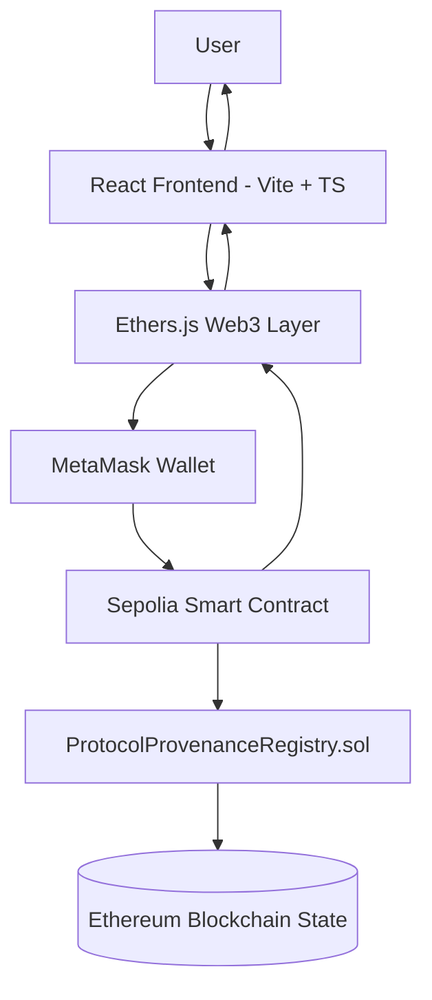
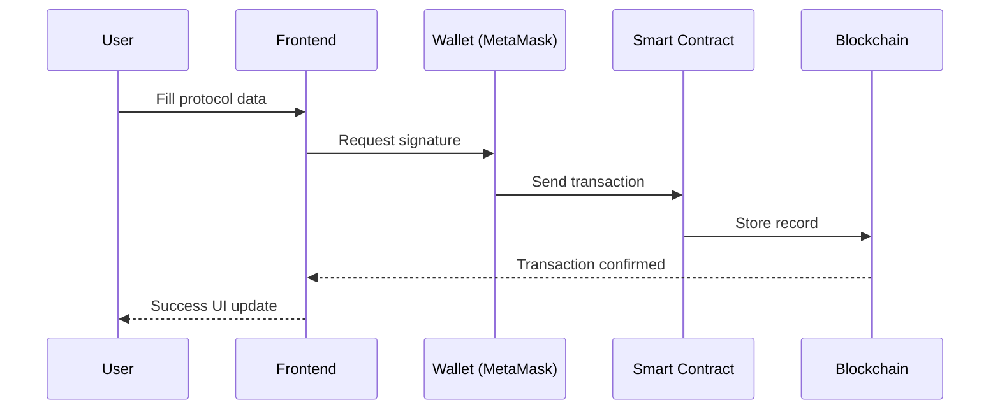
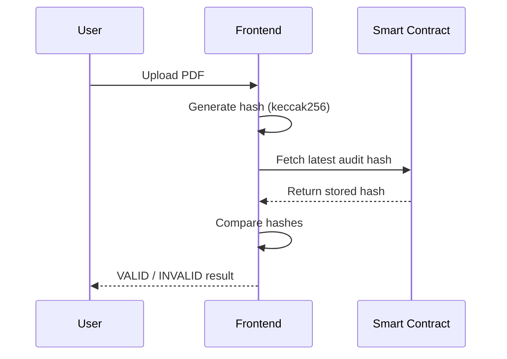
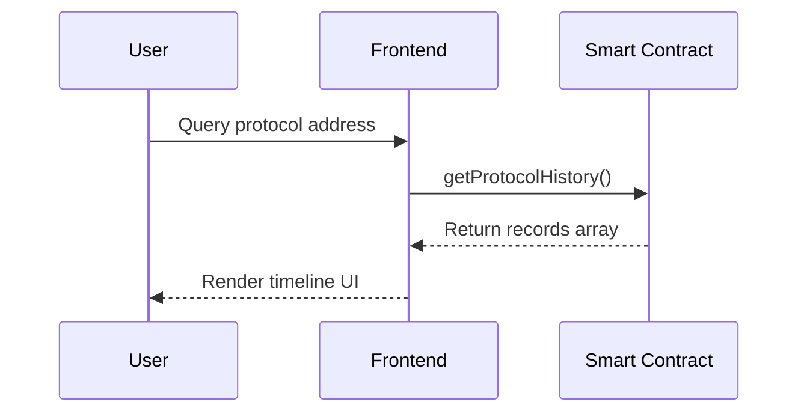

# 🧠 ProofChain — System Architecture

This document describes the full architecture of ProofChain, including smart contract design, frontend interaction flow, and blockchain integration.

---

## 🌐 High-Level Architecture



---

## 🧱 System Components

### 1. Frontend Layer (Off-chain UI)

Built with:
- React
- TypeScript
- Vite
- TailwindCSS

Responsibilities:
- User interaction
- Wallet connection (MetaMask)
- Transaction signing requests
- Displaying blockchain data

Modules:
- `Register.tsx`
- `Explorer.tsx`
- `Verify.tsx`
- `Home.tsx`

---

### 2. Web3 Integration Layer

Located in:
```
frontend/src/lib/
```

Core modules:
- `contract.ts` → smart contract abstraction
- `web3.ts` → provider + signer setup
- `WalletProvider.tsx` → global wallet state
- `hashPdf.ts` → cryptographic hashing
- `checkNetwork.ts` → network validation

Responsibilities:
- Bridge UI ↔ blockchain
- Manage wallet state
- Format transactions

---

### 3. Smart Contract Layer (On-chain)

Contract:
```
ProtocolProvenanceRegistry.sol
```

Deployed on:
- Ethereum Sepolia Testnet

Responsibilities:
- Store protocol provenance records
- Enforce access control (`onlyOwner`)
- Maintain version history
- Emit events for indexing

---

### 4. Blockchain Layer

Network:
- Ethereum Sepolia

Responsibilities:
- Immutable storage
- Consensus validation
- Transaction finality
- Public verifiability

---

## 🔁 Core Data Flow

### Register Flow



---

### Verify Flow



---

### Explorer Flow



---

## 🔐 Trust Model

ProofChain is designed as a **trust-minimized system**:

| Layer | Trust Requirement |
|------|------------------|
| Frontend | Untrusted |
| Wallet | User-controlled |
| Smart Contract | Trustless logic |
| Blockchain | Canonical truth |

---

## 🧾 Data Integrity Model

Each record includes:

- Protocol name
- Version number
- Auditor identity
- Audit hash (PDF integrity)
- Commit hash (code reference)
- Timestamp

### Guarantee:
> If data exists on-chain, it is immutable and verifiable.

---

## 🧠 Design Principles

- ⛓️ Blockchain as source of truth
- 🔒 Minimal trust assumptions
- 🧾 Cryptographic verification (hash-based)
- 📦 Append-only data structure
- 🔍 Full transparency via public chain

---

## 🚀 Deployment Context

- Network: Sepolia Testnet
- Framework: Hardhat + Ignition
- Frontend: React + Vite
- Web3: Ethers.js v6
- Wallet: MetaMask

---

## 🏁 Summary

ProofChain is structured as a **fully decentralized provenance system**, where:

- UI is only an interface
- Wallet handles identity
- Smart contract enforces rules
- Blockchain guarantees truth

---